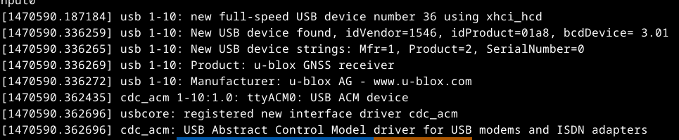

UBX2RINEX
=========

[](https://github.com/nav-solutions/ubx2rinex/actions/workflows/rust.yml)
[](https://github.com/nav-solutions/ubx2rinex/actions/workflows/daily.yml)
[](https://crates.io/crates/ubx2rinex)

[](https://github.com/nav-solutions/ubx2rinex/blob/main/LICENSE)

`ubx2rinex` is a small command line utility to deserialize
a U-Blox data stream into standardized RINEX file(s).

:warning: this tool is work in progress.

## Licensing

This application is part of the [RTK-rs framework](https://github.com/nav-solutions) which
is delivered under the [Mozilla V2 Public](https://www.mozilla.org/en-US/MPL/2.0) license.

## Install from Cargo

You can directly install the tool from Cargo with internet access:

```bash
cargo install ubx2rinex
```

## Build from sources

Download the version you are interested in:

```bash
git clone https://github.com/nav-solutions/ubx2rinex
```

And build it using cargo:

```bash
cargo build -r
```

The application uses the latest `UBX` protocol supported. This may unlock full potential
of modern devices, and does not cause issues with older firmwares, simply restricted applications.

## Getting started

To deploy, you must at least select one Constellation and one signal.  
We propose one flag per constellation, modern UBlox supports tracking of up to 3 constellations.
We offer one flag per signal.

The default opmode is Observation RINEX collection. 
In the following example, we will collect all L1 observations for GPS

```bash
RUST_LOG=trace ubx2rinex -p /dev/ttyUSB1 --gps --l1
[2025-02-23T10:48:22Z INFO  ubx2rinex] Connected to U-Blox
[2025-02-23T10:48:22Z DEBUG ubx2rinex] Software version: EXT CORE 3.01 (111141)
[2025-02-23T10:48:22Z DEBUG ubx2rinex] Firmware version: 00080000
```

Not defining a baud rate value means you are using our 115_200 default value.

In summary, the mandatory flags are:
- `-p,--port` to define your serial port
- at least one constellation activation flags, like `--gps`
- define a specific baud rate if you want

To determine your U-Blox port on linux, for example:

```bash
dmesg | tail -n 20
```



Follow through this tutorial to understand all the options we offer, especially:

- the application [default behavior](#default-behavior)
- [U-Blox configuration options](#u-blox-configuration)
- [select your constellation](#constellation)
- [Observation RINEX collection](#obs-rinex-collection)

## :warning: M8 Series usage

:warning: Until further notice :warning:

This application is compatible with M8 series device but does not offer
any option (as of today) to reprogram the Constellation / Signal settings. You will have
to use a third party tool to actually reconfigure your device. 

For example, M8T factory settings are GPS (L1) and GLO (L1).
We would deploy like this:

```bash
ubx2rinex -p /dev/ttyUSB1 --gps --glonass --l1
```

Any other constellation flags has no effect. Selecting other signals has no effect.
Removing L1 signal would create invalid RINEX.

## Application logs

`ubx2rinex` uses the Rust logger for tracing events in real-time and not disturb the collection process.  
To activate the application logs, simply define the `$RUST_LOG` variable:

```bash
export RUST_LOG=info
```

Several sensitivity options exist:

- info
- error
- debug
- trace

U-Blox configuration
====================

U-Blox receivers are very user friendly yet still require a little knowledge to operate.  
That is especially true to advanced use cases. 

The most basic configuration your need to understand, is how to parametrize the streaming options
of your U-Blox device. `ubx2rinex` allows partial reconfiguration of the U-Blox receiver:

(1) Define the streaming interface(s) and options
(2) Customize the receiver for this application's need

(1): means you can actually use `ubx2rinex` to parametrize how your U-Blox streams.
It is also necessary to activate streaming on at least the USB/UART port that you intend to use.

(2): configuring the receiver, in particular what frames it will transmit, will modify the RINEX content
we are able to collect obviously.

## USB/UART port setup

TODO

## UBX streaming setup

TODO

RINEX Collection
================

`ubx2rinex` is a collecter, in the sense that it gathers a real-time stream from your u-Blox,
and dumps it into supported RINEX formats. It is important to keep in mind that, in order to format
a meaningful (and correct) RINEX header, we can only redact it after completion of a first entire epoch,
every time a new gathering period starts.

File name conventions
=====================

`ubx2rinex` follows and uses RINEX standard conventions. By default we will generate
RINEX `V2` (short) filenames, as it only requires one field to be complete.
By default, this field is set to `UBX`, but you can change that with `--name`:

```bash
RUST_LOG=trace ubx2rinex -p /dev/ttyUSB1 --gps --name M8T
```

Signal Collection
=================

The default `ubx2rinex` collection mode is Observation RINEX collection.  

Using this mode, you can use your U-Blox as a real-time signal source (sampler)
which is then collected as [Receiver Independent EXchange](https://github.com/nav-solutions/rinex)
for distribution, post processing and much more. The default RINEX format garantees 17 digits 
of precision on sampled signal and 14 digits on the local clock state.

Observation RINEX collection is the default mode and deploys at all-times, unless you
use the `--no-obs` flag, which will disable this mode: 

```bash
./target/release/ubx2rinex \
        -p /dev/ttyACM0 \
        -b 115200 \
        --gps \
        --l1 \
        --rx-clock \
        -m "M8T u-Blox"

[2025-02-25T20:30:01Z DEBUG ubx2rinex::device] U-Blox Software version: EXT CORE 3.01 (111141)
[2025-02-25T20:30:01Z DEBUG ubx2rinex::device] U-Blox Firmware version: 00080000
[2025-02-25T20:30:01Z INFO  ubx2rinex::device] Enabled constellations: GPS, Glonass, 
[2025-02-25T20:30:01Z INFO  ubx2rinex::device] Supported constellations: GPS, Galileo, BeiDou, Glonass, 
[2025-02-25T20:30:01Z DEBUG ubx2rinex] UBX-NAV-EOE enabled
[2025-02-25T20:30:02Z DEBUG ubx2rinex] UBX-NAV-PVT enabled
[2025-02-25T20:30:02Z DEBUG ubx2rinex] UBX-NAV-CLK enabled
[2025-02-25T20:30:02Z DEBUG ubx2rinex] UBX-NAV-PVT enabled
[2025-02-25T20:30:02Z DEBUG ubx2rinex] Measurement rate is 30 s (Gps)
[2025-02-25T20:30:03Z INFO  ubx2rinex] Observation RINEX mode deployed
[2025-02-25T20:30:03Z INFO  ubx2rinex] 2025-02-25T20:30:18.313672551 GPST - program deployed
[2025-02-25T20:30:12Z TRACE ubx2rinex::collecter] 2025-02-25T20:30:30.006000000 GPST - (G02 RAWX) - pr=2.2654484E7 cp=1.1905012E8 dop=-1.1215144E3 cno=25
[2025-02-25T20:30:12Z TRACE ubx2rinex::collecter] 2025-02-25T20:30:30.006000000 GPST - (G03 RAWX) - pr=2.1846652E7 cp=1.1480491E8 dop=6.1150366E2 cno=37
[2025-02-25T20:30:12Z TRACE ubx2rinex::collecter] 2025-02-25T20:30:30.006000000 GPST - (R19 RAWX) - pr=2.4613278E7 cp=1.3166441E8 dop=-3.8444370E3 cno=23
[2025-02-25T20:30:12Z DEBUG ubx2rinex] NAV PVT: NavPvt { itow: 246630000, year: 2025, month: 2, day: 25, hour: 20, min: 30, sec: 12, valid: 55, time_accuracy: 50, nanosecond: 371019, fix_type: Fix3D, flags: NavPvtFlags(GPS_FIX_OK), flags2: NavPvtFlags2(RESERVED1 | RESERVED3 | CONFIRMED_AVAI | CONFIRMED_DATE | CONFIRMED_TIME), num_satellites: 8, lon: 4.635316899999999, lat: 43.6876077, height_meters: 65.992, height_msl: 18.155, horiz_accuracy: 21079, vert_accuracy: 24241, vel_north: 0.081, vel_east: 0.092, vel_down: -0.129, ground_speed: 0.123, heading: 0.0, speed_accuracy_estimate: 0.20400000000000001, heading_accuracy_estimate: 162.7699, pdop: 204, reserved1: [0, 0, 74, 100, 35, 0], heading_of_vehicle: 0.0, magnetic_declination: 0.0, magnetic_declination_accuracy: 0.0 }
[2025-02-25T20:30:12Z DEBUG ubx2rinex] nav-sat: NavSat { itow: 246630000, version: 1, num_svs: 21, reserved: [0, 0], [...] }
[2025-02-25T20:30:12Z DEBUG ubx2rinex] NAV CLK: NavClock { itow: 246630000, clk_b: 628984, clk_d: 187, t_acc: 50, f_acc: 736 }
[...]
```

## Observation RINEX Timescale

:warning: Observation RINEX express timestamps and clock states in a specific [GNSS Timescale](https://github.com/nav-solutions/gnss),
not UTC. 

`ubx2rinex` is smart, it will adapt the main Timescale to [your Constellation choices](#Constellation).

Receiver clock state collection
===============================

Observation RINEX allows describing the receiver clock state with 14 digits precision.  
This is optional and disabled by default. If you are interested in capturing and distributing your local
clock state, you should turn activate this option with `--rx-clock`.

Sampling period
===============

When collecting signal observations, it is important to define your sampling period. The default sampling period is set to 30s, which is compatible with standard Observation RINEX publications.

You can use any custom value above 50ms. 

In this example, we reduce the sampling period to 1s:

```bash
ubx2rinex -p /dev/ttyACM0 \
          --gps \
          -s "1 s"
```

Snapshot period
===============

The snapshot period defines how often we release a RINEX of each kind.
When the snapshot is being released, the file handled is released and the file is ready to be distributed or post processed.

By default, the snapshot period is set to Daily, which is compatible with standard RINEX publications.  

Several options exist (you can only select one at once):

- `--hourly` for Hourly RINEX publication
- `--quarterly` for one publication every 6 hours
- `--noon` for one publication every 12 hours
- `--custom $dt` for custom publication period. Every valid `Duration` description may apply. For example, these are all valid durations: `--period  

NB: 

- the first signal observation is released everyday at midnight 00:00:00 in the main Timescale
- the last signal observation is released everyday at 23:59:30 in the main Timescale

File rotation and descriptors
=============================

`ubx2rinex` owns the File descriptor with write access (only) until the end of this period.  
That means you can only read the file until the end of the period.
Deleting the file descriptor while the program is actively collecting will the program to panic.

At the end of each period, the file descriptor is released and you can fully process it.   
The file pointer is then incremented, using standard naming conventions.

`ubx2rinex` will provide content "as soon as" it exists (+/- some file descriptor access, that we
try to keep efficient). This means that exploitation of this program is compatible with real-time
watching of the file being produced and each new symbol is published fairly quickly.

Program interruption and release
================================

`ubx2rinex` does not support Ctrl+C interruption cleanly as of today.

Other customizations
====================

- Define your name as `Operator`` in RINEX terminology,
with `--operator myself`
- Define your name as `Observer`` in RINEX terminology,
with `--observer myself`
- Define your agency (publisher) with `--agency myagency`
- Define the country code (3 letter) of your agency with `--country ABC`

no-std
======

This program relies on both the `ubx` parser and the `rinex` library.  
The first one supports `no-std`, but it is unfortunately not true for the latter.  
We will see if we can provide some very reduced, `no-std` compatible portions of the `rinex` library
in the future, especially the file production side. 
This is not scheduled work as of today. Feel free to join in if you want to see this happen sooner.
